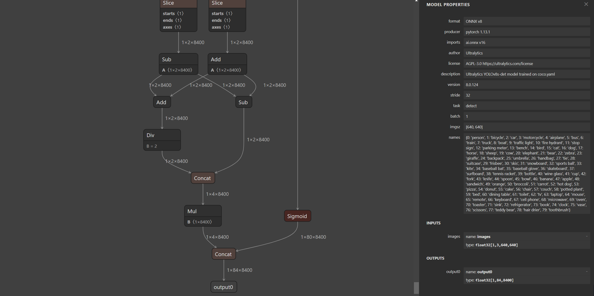
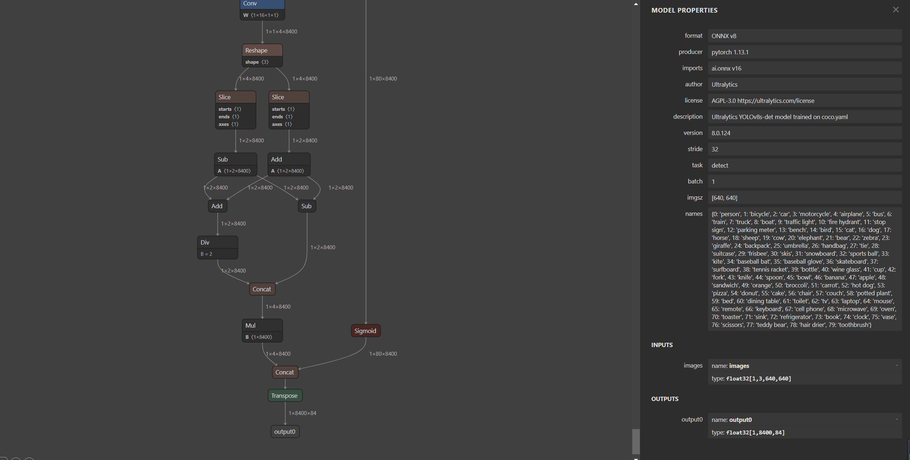

# YOLOv8

针对YOLOv8剪枝以及量化和部署准备工作，作如下记录：
主要包含 YOLOv8 模型的训练、onnx的导出/修改以及tensorrt部署对接 🏁

repo：

[https://github.com/ultralytics/ultralytics](https://github.com/ultralytics/ultralytics)


- 2023.7.8 trt部署对接；
- 2023.7.7 ort测试对接；
- 2023.7.6 训练数据voc(xml)->yolo(txt)准备脚本；
- 2023.7.5 动态batch onnx 导出指导；
- 2023.7.4 onnx 修改；
- 2023.7.3 yolov8 install 以及 测试（预测）、训练和onnx导出脚本测试；

---

1. clone the ultralytics repository

```
git clone https://github.com/ultralytics/ultralytics
```

2. navigate to the cloned directory

```
cd ultralytics
```

3. install the package in editable mode for development

```
pip install -e .
```

4. test env

```
python test.py
```

5. train

```
python train.py
```

6. export onnx

```
python export.py
```



7. export dynamic batch(可选)

后续补充

8. transpose

v8 + transpose 更改输出维度顺序 与v5保持一致 方便通用框架trt推理

```
python v8trans.py
```



9. change name
   更改 v8 输出节点name 与v5保持一致 方便通用框架trt推理

```
python onnx_cg_ioname.py  ./workspace/weights/yolov8s-det.transd.onnx 
```


:octocat::octocat:
