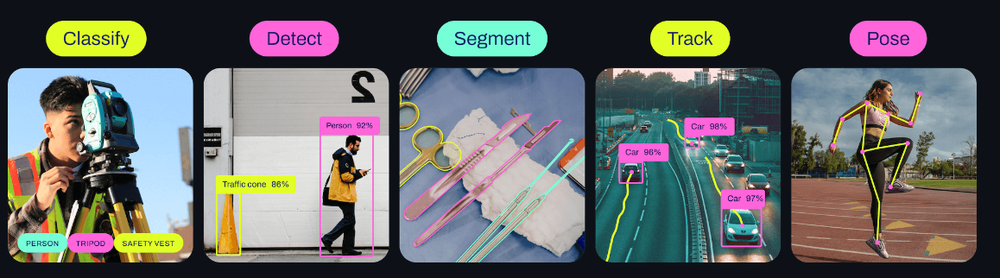
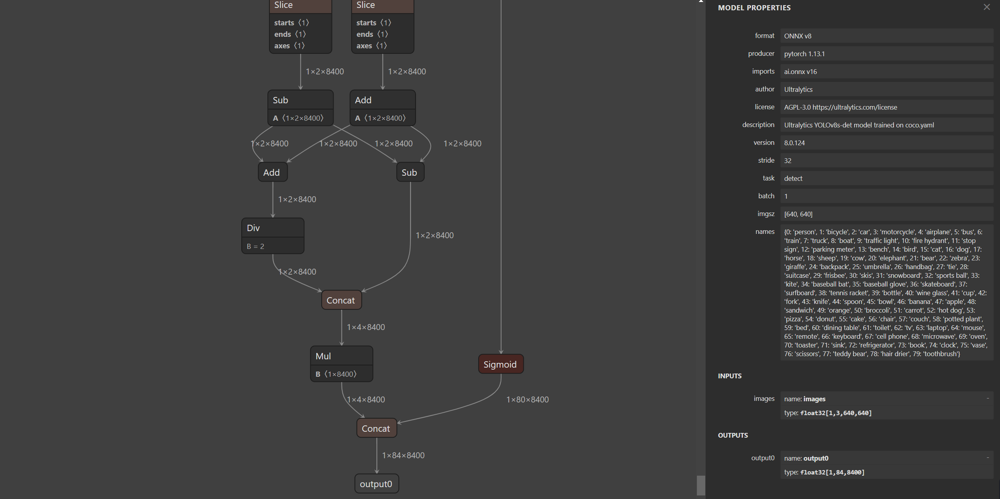
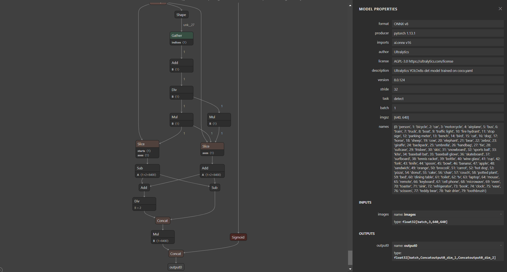
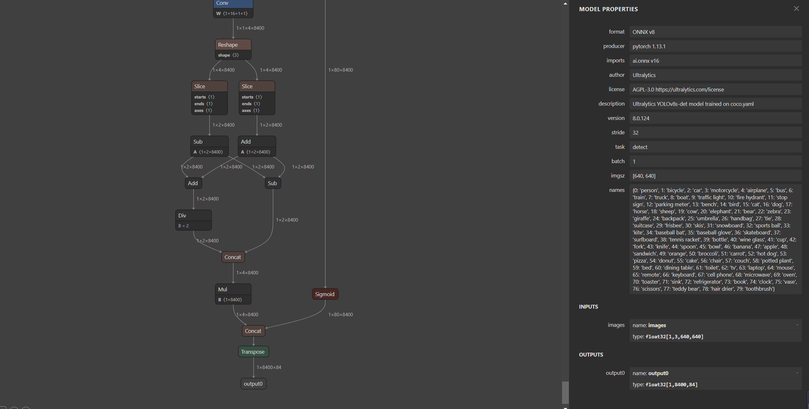
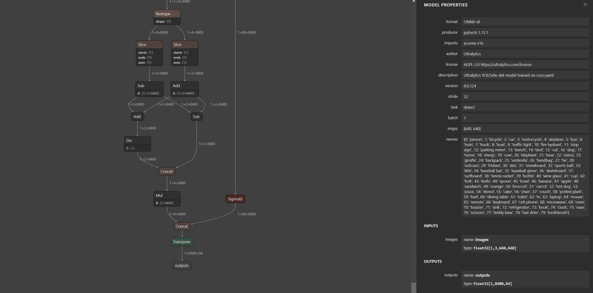

# YOLOv8

针对YOLOv8剪枝以及量化和部署准备工作，作如下记录：
主要包含 YOLOv8 模型的训练、onnx的导出/修改以及tensorrt部署对接 🏁

repo：

[https://github.com/ultralytics/ultralytics](https://github.com/ultralytics/ultralytics)




- 2023.7.13  onnx+nms;
- 2023.7.12  ncnn部署；
- 2023.7.11  rknn部署；
- 2023.7.10  opencv部署；
- 2023.7.9   trt部署；
- 2023.7.8   ort部署；
- 2023.7.7   map计算，测试量化/剪枝精度；
- 2023.7.6   训练数据voc(xml)->yolo(txt)准备脚本；
- 2023.7.5   动态batch onnx 导出指导；
- 2023.7.4   onnx 修改；
- 2023.7.3   yolov8 install 以及 测试（预测）、训练和onnx导出脚本测试；

主要以YOLOv8 det为主，后续补充seg, 完整流程。

---

一、环境安装、训练以及ONNX修改

1. clone the ultralytics repository

```
git clone https://github.com/ultralytics/ultralytics
```

2. navigate to the cloned directory

```
cd ultralytics
```

3. install the package in editable mode for development

```
pip install -e .
```

4. test env

```
python test.py
```

5. train

```
python train.py
```

在模型训练之前需要准备训练数据，针对目标检测任务，可以使用[labelImg](https://github.com/heartexlabs/labelImg)对训练数据标注，或者使用[anylabeling](https://github.com/vietanhdev/anylabeling)进行半自动化标注，节省标注时间成本。标注可以直接标注YOLO(txt)格式，也可以标注VOC(xml)格式，再转换到YOLO(txt)格式，转换脚本为：

```
def convert_box(size, box):
   dw, dh = 1. / size[0], 1. / size[1]
   x, y, w, h = (box[0] + box[1]) / 2.0 - 1, (box[2] + box[3]) / 2.0 - 1, box[1] - box[0], box[3] - box[2]
   return x * dw, y * dh, w * dw, h * dh
```
笔者以VOC数据集为例对数据进行处理流程如下：

download VOC --> python data.py --> XX.yaml --> python train.py

6. export onnx

```
python export.py
```



7. export dynamic batch(可选)

```
笔者 ultralytics 安装版本 8.0.124：
更改exporter.py export_onnx 函数
309行：
dynamic = {'images': {0: 'batch'}} #（batch, 3, 640, 640)
314行：
dynamic['output0'] = {0: 'batch'}
```

export.py dynamic设置为True
```
sucess = model.export(format='onnx', simplify=True, dynamic=True)
```
```
python export.py
```

tensorrt动态batch推理，trt内部做了并行优化，充分压榨GPU资源，提升模型推理性能，是一个需要掌握的策略。




8. transpose

v8 + transpose 更改输出维度顺序 与v5保持一致 方便通用框架trt推理

```
python v8trans.py
```



9. change name
   更改 v8 输出节点name 与v5保持一致 方便通用框架trt推理

```
python onnx_cg_ioname.py  ./workspace/weights/yolov8s-det.transd.onnx 
```



二、 模型部署对接

待补充


:octocat::octocat:

NOTE!